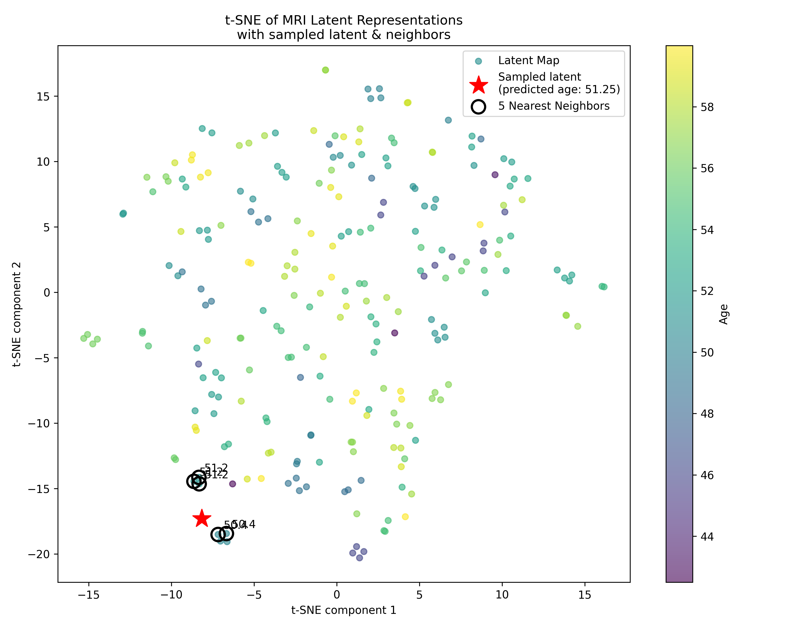

# Guided Pyraug

This guide provides instructions for setting up and using **Guided Pyraug**, a tool for generating latent maps and performing guided sample generation leveraging [Pyraug](https://github.com/clementchadebec/pyraug).

---

## Installation

1. **Create a Conda Environment**:
```bash
   conda create -n guidedPyraug python==3.10.16
```
2. **Activate the Environment:**
```bash
  conda activate guidedPyraug
```
3.	**Install Required Packages:**

```bash
    pip install pyraug torch torchvision pandas matplotlib scikit-learn
```

## Creating Latent Maps

Requirements:
	•	Oasis Dataset: NIfTI .nii.gz files.
	•	Oasis Labels: CSV file containing info about mri scans and patients age located in the dataset root directory.
	•	Pretrained Pyraug Weights: A folder containing the trained Pyraug model.

Command:

Run the following script to create a latent map:

```bash
  python3 utils/create_latent_map.py --path_to_model_folder <path_to_pyraug_model> --volumes_folders <path_to_oasis_data_samples>
```

    • Replace <path_to_pyraug_model> with the directory path of the Pyraug pretrained model.
    • Replace <path_to_oasis_data_samples> with the directory path containing the Oasis dataset.

Output:
	•	The script will generate a .pkl file containing the latent map.

## Visualizing the Latent Space:

Use the following script to visualize the latent space:
``` bash
    python3 utils/show_latent_map.py
```
Example visualization 




## Guided Sample Generation

Use the following command to launch the sample generation:
``` bash
    python3 guided_generation.py --path_to_model_folder <path_to_pyraug_model> --desired_age <float_or_int>
``` 
``` 
Notes:
	•	Replace <path_to_pyraug_model> with the directory path of the pretrained Pyraug model.
	•	Replace <float_or_int> with the desired age for sample generation.
	•	Additional arguments can be passed; refer to the script for more options.
``` 
